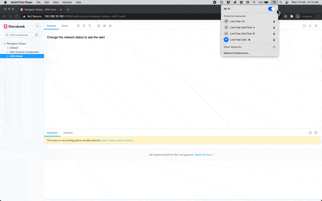

Adding online/offline status to your application can make it more user intuitive
and helps users in taking quick actions before interacting with the application.
`react-navigator-status` exports a component and a hook that you can use to show online/offline alerts to your users.



## Code Sandbox

<iframe src="https://codesandbox.io/embed/react-navigator-status-gi1gg?fontsize=14&hidenavigation=1&theme=dark"
     style="width:100%; height:500px; border:0; border-radius: 4px; overflow:hidden;"
     title="react-navigator-status"
     allow="accelerometer; ambient-light-sensor; camera; encrypted-media; geolocation; gyroscope; hid; microphone; midi; payment; usb; vr; xr-spatial-tracking"
     sandbox="allow-forms allow-modals allow-popups allow-presentation allow-same-origin allow-scripts"
   ></iframe>

This component is inspired by [react-detect-offline](https://www.npmjs.com/package/react-detect-offline). The major benefit of using this that instead of polling network status this component uses online and offline event listeners https://developer.mozilla.org/en-US/docs/Web/API/NavigatorOnLine/Online_and_offline_events. Also, it is written in TypeScript and follows type-safe measures.

## How to use?

### Installation

- Yarn: `yarn add react-navigator-status`
- npm: `npm install react-navigator-status`

### Usage

You can use this package in 3 ways

1. Default component
2. using the hook
3. using the render props with default component

### 1. Default Component

```tsx
import * as React from "react"
import { NavigatorStatus } from "react-navigator-status"

const App = () => {
  return <NavigatorStatus />
}
```

### 2. Using Hook

- `useNavigatorStatus` hook returns the online status and listens to the network change in real time

```tsx
import * as React from "react"
import { useNavigatorStatus } from "react-navigator-status"

// doesn't show alert initially
// show offline alert forever
// show online alert for 4s

const Alert: React.FC<{ isOnline: boolean }> = ({ isOnline }) => {
  const [showAlert, setShowAlert] = React.useState(false)

  React.useEffect(() => {
    let isMounted = true

    if (isOnline && showAlert && isMounted) {
      setShowAlert(true)

      setTimeout(() => {
        if (isMounted) {
          setShowAlert(false)
        }
      }, 4000)
    }

    if (!isOnline && isMounted) {
      setShowAlert(true)
    }

    return () => {
      isMounted = false
    }
  }, [isOnline])

  return (
    <div
      style={{
        fontFamily: `sans-serif`,
      }}
    >
      {showAlert && (
        <div
          style={{
            color: "white",
            padding: 20,
            marginBottom: 20,
            background: isOnline ? `rgb(59, 201, 149)` : `#ff5733`,
          }}
        >
          {isOnline
            ? `You are online`
            : `You are offline please check your connection`}
        </div>
      )}
      <p>Change the network status to see the alert</p>
    </div>
  )
}

const App = () => {
  const isOnline = useNavigatorStatus()
  return <Alert isOnline={isOnline} />
}
```

### 3. With render props

- `NavigatorStatus` component gives you render prop with `isOnline` which you can use further to render alert as per your needs.

```tsx
import * as React from "react"
import { NavigatorStatus } from "react-navigator-status"

// doesn't show alert initially
// show offline alert forever
// show online alert for 4s

const Alert: React.FC<{ isOnline: boolean }> = ({ isOnline }) => {
  const [showAlert, setShowAlert] = React.useState(false)

  React.useEffect(() => {
    let isMounted = true

    if (isOnline && showAlert && isMounted) {
      setShowAlert(true)

      setTimeout(() => {
        if (isMounted) {
          setShowAlert(false)
        }
      }, 4000)
    }

    if (!isOnline && isMounted) {
      setShowAlert(true)
    }

    return () => {
      isMounted = false
    }
  }, [isOnline])

  return (
    <div
      style={{
        fontFamily: `sans-serif`,
      }}
    >
      {showAlert && (
        <div
          style={{
            color: "white",
            padding: 20,
            marginBottom: 20,
            background: isOnline ? `rgb(59, 201, 149)` : `#ff5733`,
          }}
        >
          {isOnline
            ? `You are online`
            : `You are offline please check your connection`}
        </div>
      )}
      <p>Change the network status to see the alert</p>
    </div>
  )
}

const App = () => {
  return (
    <NavigatorStatus>
      {({ isOnline }) => <Alert isOnline={isOnline} />}
    </NavigatorStatus>
  )
}
```

Enjoy using `react-navigator-status` and shower some love to [github repo](https://github.com/lakhansamani/react-navigator-status) 🎉
